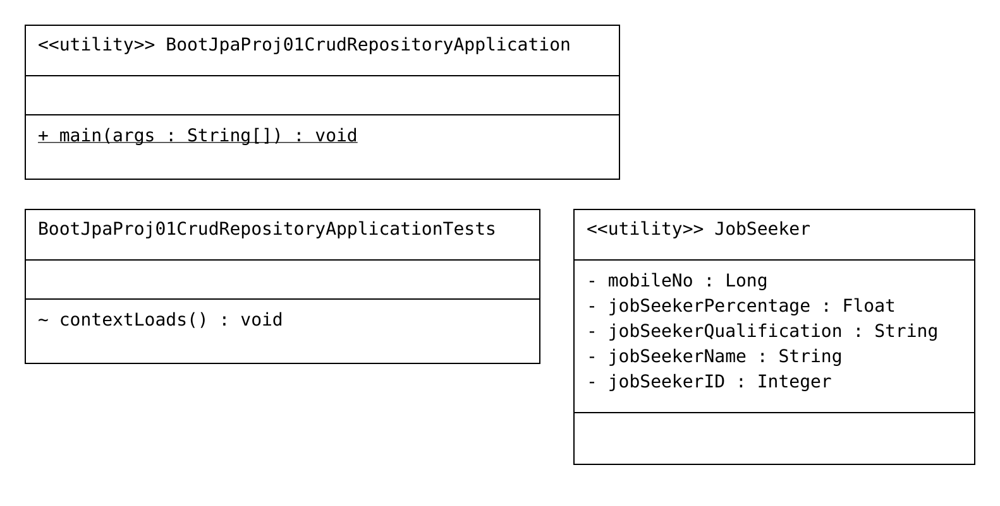

# BootJpaProj01-CrudRepository



# **Code**

```Java
package com.nt;

import org.springframework.boot.SpringApplication;
import org.springframework.boot.autoconfigure.SpringBootApplication;

@SpringBootApplication
public class BootJpaProj01CrudRepositoryApplication {

	public static void main(String[] args) {
		SpringApplication.run(BootJpaProj01CrudRepositoryApplication.class, args);
	}

}
```


```Java
package com.nt.entity;

import jakarta.persistence.Column;
import jakarta.persistence.Entity;
import jakarta.persistence.GeneratedValue;
import jakarta.persistence.GenerationType;
import jakarta.persistence.Id;
import jakarta.persistence.Table;
import lombok.Data;

@Entity
@Table(name = "JOB_SEEKER_INFO")
@Data
public class JobSeeker {
	@Id
	@GeneratedValue(strategy = GenerationType.AUTO)
	@Column(name = "JS_ID")
	private Integer jobSeekerID;
	@Column(name = "JS_NAME", length = 20)
	private String jobSeekerName;
	@Column(name = "JS_QLFY", length = 20)
	private String jobSeekerQualification;
	@Column(name = "JS_PERCENTAGE")
	private Float jobSeekerPercentage;
	@Column(name = "JS_CONTACT_INFO")
	private Long mobileNo;

}
```

```Java
spring.jpa.hibernate.ddl-auto=update
spring.datasource.url=jdbc:mysql://localhost:3306/retail_store
spring.datasource.username=root
spring.datasource.password=password
spring.datasource.driver-class-name=com.mysql.cj.jdbc.Driver
spring.jpa.show-sql=true
spring.datasource.hikari.minimum-idle=10
spring.datasource.hikari.maximum-pool-size=1000
```

## **_POM_**
```xml
<dependencies>
		<dependency>
			<groupId>org.springframework.boot</groupId>
			<artifactId>spring-boot-starter-data-jpa</artifactId>
		</dependency>
		<dependency>
			<groupId>com.mysql</groupId>
			<artifactId>mysql-connector-j</artifactId>
		</dependency>
		<dependency>
			<groupId>com.oracle.database.jdbc</groupId>
			<artifactId>ojdbc11</artifactId>
			<scope>runtime</scope>
		</dependency>
		<dependency>
			<groupId>org.projectlombok</groupId>
			<artifactId>lombok</artifactId>
			<optional>true</optional>
		</dependency>
		<dependency>
			<groupId>org.springframework.boot</groupId>
			<artifactId>spring-boot-starter-test</artifactId>
			<scope>test</scope>
		</dependency>
	</dependencies>
    <build>
		<plugins>
			<plugin>
				<groupId>org.springframework.boot</groupId>
				<artifactId>spring-boot-maven-plugin</artifactId>
				<configuration>
					<excludes>
						<exclude>
							<groupId>org.projectlombok</groupId>
							<artifactId>lombok</artifactId>
						</exclude>
					</excludes>
				</configuration>
			</plugin>
		</plugins>
	</build>
```

## **_Logs_**
```
[BootJpaProj01-CrudRepository] [           main] com.zaxxer.hikari.pool.HikariPool        : HikariPool-1 - Added connection com.mysql.cj.jdbc.ConnectionImpl@594131f2
[BootJpaProj01-CrudRepository] [           main] com.zaxxer.hikari.HikariDataSource       : HikariPool-1 - Start completed.
[BootJpaProj01-CrudRepository] [           main] o.h.e.t.j.p.i.JtaPlatformInitiator       : HHH000489: No JTA platform available (set 'hibernate.transaction.jta.platform' to enable JTA platform integration)
[BootJpaProj01-CrudRepository] [           main] j.LocalContainerEntityManagerFactoryBean : Initialized JPA EntityManagerFactory for persistence unit 'default'
[BootJpaProj01-CrudRepository] [           main] n.BootJpaProj01CrudRepositoryApplication : Started BootJpaProj01CrudRepositoryApplication in 2.251 seconds (process running for 2.568)
[BootJpaProj01-CrudRepository] [ionShutdownHook] j.LocalContainerEntityManagerFactoryBean : Closing JPA EntityManagerFactory for persistence unit 'default'``````
```

## **Tables created**


